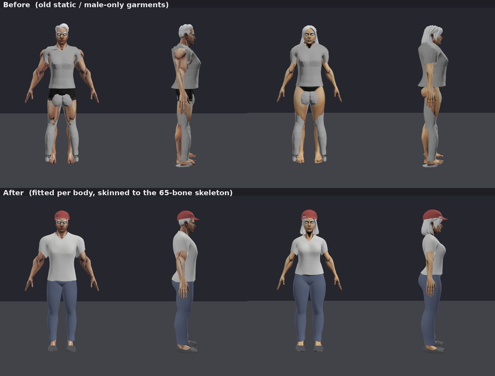
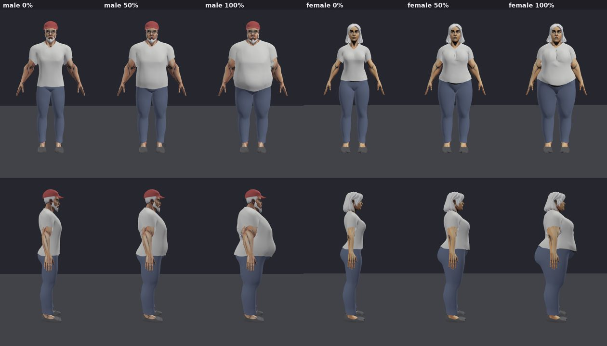

# 紙娃娃衣物自動綁定（Paper-doll garment fitter）

將「下載返嚟嘅靜態衣服」自動變成「貼身、跟骨架變形」嘅換裝部件，男女身體各出一個版本。
輸出畀 Dashboard「造型管理」嘅 `CharacterViewer` 直接用（同頭髮一樣 rebind 到身體骨架）。



## 點解要分男女

衣服 GLB 嘅 vertex 係直接寫喺「身體 bind pose」嘅座標入面，Babylon 換骨架之後用嘅係**身體**嘅
inverse bind matrices。男女身體骨架唔同（女性膊頭窄約 6cm、矮 3–5cm、胸/臀形狀唔同），
所以同一個 GLB 冇可能同時啱兩個身體 → 每件衣物都要按性別各 fit 一次：

```
packages/shared/characters/<slot>/<gender>/<name>.glb     ← 輸出（git 追蹤）
tools/paperdoll/raw/<slot>/<name>.glb                      ← 原始下載檔（唔好直接畀 viewer 用）
```

## 安裝

```bash
pip install -r tools/paperdoll/requirements.txt
```

## 用法

```bash
python tools/paperdoll/fit_garments.py                    # 全部衣物、男女都做
python tools/paperdoll/fit_garments.py shirt01            # 只做一件
python tools/paperdoll/fit_garments.py shirt01 --gender female
```

每件會印驗收結果，例如：

```
== shirt01 [female]
   -> packages/shared/characters/top/female/shirt01.glb  verts=2399 faces=3832
   skeleton: joints=65 order==body:True IBM max diff=0.0e+00 ... -> OK
   T-pose        : cloth verts inside body 0/2399 (0.0%), visible skin poking through 0/4030
   viewer A-pose : cloth verts inside body 0/2399 (0.0%), visible skin poking through 2/4030, hidden crease contacts 2
                   under pants01.glb: verts inside it 0/233 overlapping
```

- **skeleton**：骨頭數量/順序/IBM 同身體一模一樣先算 OK（唔 OK 嘅話 viewer 會亂變形）
- **T-pose / viewer A-pose**：布入咗身體幾多點、皮膚穿出布幾多點（A-pose 係 Dashboard 實際顯示嘅姿勢）
- **hidden crease contacts**：腋下等夾縫位嘅接觸，正常角度睇唔到，唔當失敗
- **under …**：外層衣物（例如上衣）有冇陷入內層（褲）
- 有任何一件唔合格，程式會以 exit code 1 結束

## 加一件新衣物

1. 將下載嘅 GLB 放入 `tools/paperdoll/raw/<slot>/<name>.glb`
2. 喺 `garments.json` 加一項（可以抄一件同類嘅改）。**底層衣物要排喺外層前面**（褲 → 上衣），
   因為上衣會用已 fit 好嘅褲做碰撞
3. `python tools/paperdoll/fit_garments.py <name>`，睇驗收輸出
4. 睇效果：Dashboard → 造型管理，或者用無頭截圖工具（見下）
5. 喺 `packages/dashboard/main/src/app/npc/appearances/page.tsx` 嘅 `WEARABLES` 加 id，
   `src/locales/en.ts`、`zh-TW.ts` 加名稱

### 常見調整

| 現象 | 調咩 |
|---|---|
| 前後掉轉（例如正面見到屁股、帽舌向後） | `yaw: 180` |
| 對鞋左右要分開 fit | `per_part: true`（每隻鞋獨立轉向/縮放） |
| 太鬆 / 太緊 | `target_offset`（同皮膚嘅理想距離）、`min_offset`（最少距離） |
| 衫袖/褲管對唔到手腳 | `pose` 範圍（`arms` 手臂下垂角度、`legs` 雙腳張開角度，弧度） |
| 位置高低唔啱 | `anchors`（`top`/`bottom` 對齊某條骨或 `ground`/`head_top` + 偏移米數） |
| 肌肉位穿出、局部有尖角 | `inflate_radius` 加大（先大範圍平滑膨脹） |
| 上衣衫腳同褲頭互穿 | 上衣加 `over: ["褲名"]`；`min_offset_zones` 令腰以下留多啲位 |
| 帽、頭盔等硬物件 | `rigid_bone: "Head"`（只會等比放大，唔會局部變形） |
| 帽要包住頭髮 | `over_files: ["hair/{gender}/*.glb"]` + `under_as_thickness: true`，`under_compress` 頭髮壓扁比例 |

### `garments.json` 欄位

| 欄位 | 意思 |
|---|---|
| `name` / `slot` / `source` | 輸出檔名、槽位（`top`/`bottom`/`shoe`/`head`）、原始檔 |
| `yaw` | 繞 Y 軸轉幾多度（修正前後方向） |
| `drop_inner_layer` | 有厚度嘅衣服刪走睇唔到嘅內層（預設開） |
| `subdivide` / `taubin` | 細分次數、平滑次數（low-poly 衣服建議 `1` / `2–4`） |
| `pose` | fit 時身體擺嘅姿勢範圍，optimizer 會揀最啱嗰個角度 |
| `init_bones` / `init_axis` / `init_ease` | 初始尺寸：用邊幾條骨覆蓋嘅身體範圍、邊條軸量度、寬鬆系數 |
| `region_bones` | 呢件衣物覆蓋嘅身體部位（用嚟檢查皮膚有冇穿出） |
| `anchors` | 高度對齊，見上表 |
| `aniso_limit` / `aniso_y` | 允許 X/Z（同 Y）各自縮放幾多（log 範圍） |
| `cover_weight` / `inside_weight` / `anchor_weight` | 粗對位各項成本權重 |
| `tighten` | 將離身太遠嘅布拉近 |
| `inflate_radius` | 大範圍平滑膨脹半徑（米） |
| `over` / `over_files` | 着喺邊啲衣物/頭髮外面 |
| `rigid_bone` | 硬物件：全部權重畀呢條骨 |
| `color` / `roughness` / `crease_deg` | 材質顏色、粗糙度、自動平滑角度 |
| `fat` | 只用於肥身形 fit 嘅覆寫，例如 `{ "collide_iters": 24, "poke_tolerance": 0.015 }` |
| `poke_tolerance` | 驗收時可見穿出點佔皮膚樣本嘅上限（預設 1%） |

## 原理（每件 × 每個性別）

1. **清理原檔**：轉向、刪內層、細分 + 平滑
2. **粗對位**：將身體擺成衣物嘅姿勢（例如手臂垂到衫袖角度），用 optimizer 揀縮放/位置/各軸比例/姿勢角度，
   令布同皮膚距離最接近 `target_offset`，同時要遮住應該遮嘅部位
3. **騰出空間**：先大範圍平滑膨脹，再做 active-set Laplacian 碰撞：布唔可以入身體/內層衣物，
   皮膚（頂點 + 三角形中心）唔可以穿出布；修正會擴散成順滑嘅鼓起而唔係尖角
4. **權重轉移**：由最近嘅身體表面點插值骨骼權重；只信任「布同皮膚面向同一方向」嘅配對，
   其餘用最近可信點補（避免衫袖底錯攞脊椎權重）
5. **擺去 Dashboard 嘅 A-pose**：用旋轉 Laplacian 座標放鬆（腋下唔會擠縐），再碰撞一次
6. **反向 skinning** 返 T-pose bind pose，輸出帶住身體骨架 + IBM 嘅 GLB

## 體型（標準 ↔ 肥胖）



肥身形用 **glTF morph target**（名 `fat`）做，同一個 mesh、同一套 UV/骨架/權重，polygon 數完全一樣，
Dashboard 用「體型」滑桿控制 0–100%（中間身形都得）。所有着喺身上嘅嘢都帶住同名 morph，一齊變：

- **身體**：`python tools/paperdoll/body_shapes.py` —— 按骨骼權重向外推（肚、腰、大腿多，手腳少），
  再加大肚腩（向前向下）、游泳圈、胸、屁股、雙下巴、臉頰；眼眶同嘴唇唔郁；平滑處理避免摺痕。
  脂肪量喺 script 頂部 `BONE_FAT` / `EXTRAS` 調
- **衣物**：`fit_garments.py` fit 完標準身形之後，自動將身體變形轉移落件衫，喺肥身上（A-pose）再做
  膨脹 + 填平凹位 + 碰撞，寫入同一個 GLB。只重做肥版：`python tools/paperdoll/fit_garments.py --fat-only`
- **頭髮、鬍鬚**：`garments.json` 嘅 `follow_body_shape`（只轉移變形，唔做碰撞）
- 驗收會分開報告 `[fat]` 結果；肥大腿內側/褲襠等夾縫位計做 hidden crease contacts

**改咗身體脂肪量之後**：先跑 `body_shapes.py`，再跑 `fit_garments.py --fat-only`。

## 身體嘅眼睛同眉毛

身體 GLB 匯出時冇咗面部貼圖（眼球純白、冇眼珠；眉毛顏色淨係留喺第二組頂點色 `COLOR_1`，glTF 唔會用）。
`fix_body_face.py` 會按眼球 UV 畫一張眼睛貼圖（眼白/虹膜/瞳孔）嵌入身體 GLB，並將眉毛材質設返原本嘅啡色。
如果之後換過身體模型，重跑一次就得：

```bash
python tools/paperdoll/fix_body_face.py
```

## 無頭截圖（可選）

`preview/` 用同 `CharacterViewer` 一樣嘅載入、A-pose、換骨架邏輯截圖，適合冇開 Dashboard 時檢查：

```bash
cd tools/paperdoll/preview && npm install
node shoot.mjs shots/outfit female top/female/shirt01.glb,bottom/female/pants01.glb,hair/female/long.glb apose front,side,back
```

## 已知限制

- 衣服按 Dashboard 嘅 A-pose 同 T-pose 驗收；遊戲內大幅度動作（例如舉高手）腋下等位置仍可能有少量穿模。
  將來可以加「衣服遮住嘅身體三角形自動隱藏（body masking）」根治
- 上衣係套住 `pants01` fit 嘅；冇着褲時衫腳會稍為鬆少少（正常）。加新嘅褲/裙時，記得喺上衣嘅 `over` 加埋再重跑上衣
- 帽唔支援女性 `bun`（髻）髮型（會互穿）；其他髮型 OK
- 原始衣物係 low-poly，細分 + 平滑之後仍然睇得出原本嘅造型限制（例如鞋頭）
